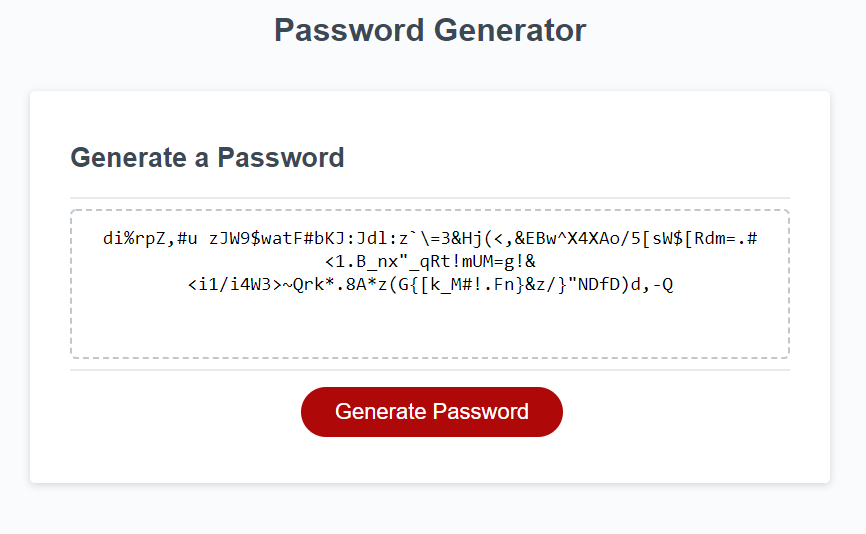

# Password Generator

## Description

The following application is a webpage application that will generate a random password.

The user will be asked a series of questions about the length of the password and what types of characters to include.

Once all the required inputs are in place, the new password is generated and displayed on the page and the user may copy and paste from their browser.

## Technologies

I only used the provided CSS and HTML files in addition to the javaScript I added to the provided .js file. 

## What I learned:

* I learned syntax for a lot of string and array functions
* I found a bunch of online resources for javascript
* I have started writing pseudocode - it helps so much!
* I came up with a system for commenting on what functions do

## What I want to know more about:

* I just want to read the javascript documentation to find out available functions.
* I also want to work more with the DOM and manipulating HTML with JS.
* I want to keep some functions I use a lot in a file and just include the file on everything I do.
 
## What I struggled with:

I had a lot fewer struggles with this project maybe because I wrote better comments or because I broke up complex actions into functions.
 
## Functionality Demonstration

Click [here](https://www.awesomescreenshot.com/video/2326247?key=5cf40401be0223667ef5f7cdfaf7b2bd) for a video demonstration of the application's functionality.
